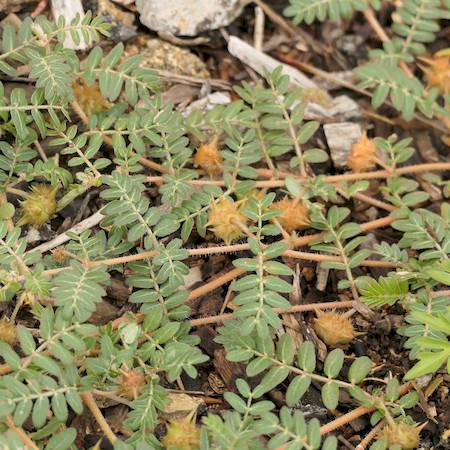

## Zygophyllaceae
# Tribulus terrestris
**common names:** caltrop

**Plant Form** Spreading annual herb. **Size** Up to 80 cm long. **Stem** Reddish-brown to green, many branched, scrambling low to ground. Silvery appearance due to covering of hairs. **Leaves** Compound of leaflet pairs, between 4-7 leaflets per leaf, plus single leaf at ends, opposite on stems. **Flowers** Bright yellow, 5 petals opening in the morning, which are usually lost quickly, single at leaf junction. **Fruit and Seeds** Nearly spherical woody hard burrs to 1 cm long, with sharp rigid spines up to 8 mm long. Break into 5 wedge shaped nutlets with 2-4 seeds. **Habitat** Roadsides, pastures, neglected areas, cropping areas. **Distinguishing Features** Many similar species, and debate over whether many are native, combination of features and where found is the best clue.

 *Flower* 

 *Seeds, note spines* 

 *Foliage and seeds* 

 *Infestation* 

